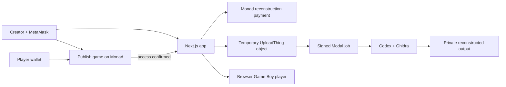

# HexBounty

HexBounty turns a Game Boy binary into a shareable browser game. A creator pays
for reconstruction on Monad Testnet, follows the Codex and Ghidra job, publishes
the completed result, and earns MON whenever another wallet unlocks it.

[Live app](https://arcade-liart-eight.vercel.app) ·
[Upload a game](https://arcade-liart-eight.vercel.app/reconstruct) ·
[Creator leaderboard](https://arcade-liart-eight.vercel.app/leaderboard)

## Product flow

1. Connect MetaMask on Monad Testnet and sign in with a wallet signature.
2. Enter the listing details, reconstruction reward, and future play price.
3. Confirm the reconstruction payment and upload one `.gb` or `.gbc` file.
4. A private Modal worker runs Codex CLI, Ghidra, GhidraBoy, and the bounded
   reconstruction harness.
5. Review and accept the result, then publish the game under a shareable slug.
6. Other wallets pay the listed MON price to unlock browser play.
7. Confirmed purchases rank the creator on the public leaderboard.

The reconstruction payment is part of **Upload game**, not a separate product.
Internally, `HexBountyEscrow` holds that reward until the result is accepted or
the deadline allows a refund. Player purchases use the separate paid-play
registry and credit 97.5% of each payment to the creator.

## Live infrastructure

| Resource | Value |
|---|---|
| Web app | [arcade-liart-eight.vercel.app](https://arcade-liart-eight.vercel.app) |
| Source | [github.com/perfect7613/hexbounty](https://github.com/perfect7613/hexbounty) |
| Network | Monad Testnet (`10143`) |
| Reconstruction API | `https://ameymuke252003--hexbounty-user-jobs-api.modal.run` |
| Escrow | [`0xc3F9fb30d87CFf804F394C680Ed7856B055F7c96`](https://testnet.monadscan.com/address/0xc3F9fb30d87CFf804F394C680Ed7856B055F7c96) |
| Paid play | [`0xef61C98BE27E1381cB7188975F8D7e938d1a0E64`](https://testnet.monadscan.com/address/0xef61C98BE27E1381cB7188975F8D7e938d1a0E64) |

Both contracts are source-verified on Monad Testnet. They are demo contracts,
not audited production financial infrastructure.

## Architecture



The source object is deleted after the Modal handoff. Completed output stays
server-side and is streamed only after SIWE and an onchain access check.

## Technology

- Next.js 16, React 19, TypeScript
- MetaMask SDK, wagmi, viem, SIWE
- Solidity, Hardhat, Monad Testnet
- UploadThing v7 and Modal
- Codex CLI, Ghidra, GhidraBoy, SameBoy
- Browser Game Boy emulator

## Run locally

```bash
cd arcade
cp .env.example .env.local
npm ci
npm run dev
```

The checked-in [`arcade/.env.example`](arcade/.env.example) contains the public
testnet addresses and every required variable. Supply these server-only values:

- `AUTH_SESSION_SECRET` — at least 32 high-entropy characters
- `UPLOADTHING_TOKEN` — UploadThing v7 token
- `HEXBOUNTY_MODAL_HMAC_SECRET` — the secret shared with the Modal API

Never prefix a secret with `NEXT_PUBLIC_` and never commit `.env.local`.

## Verify

```bash
cd arcade
npm run lint
npm run typecheck
npm test
npm run build

cd ../contracts
npm test
npm run typecheck

cd ../modal
python3 -m unittest test_user_job_core.py
```

## Repository

```text
arcade/       Web marketplace, wallet flow, leaderboard, and browser player
contracts/    Reconstruction payment and paid-play contracts
modal/        Signed Codex/Ghidra reconstruction jobs
js/           TypeScript evidence helpers
python/       Python evidence helpers
```

## Future scope: recover forgotten software

Game Boy reconstruction is the first focused proving ground. The larger goal is
to help preserve software from the 1990s and other early computing eras when the
source code, build system, documentation, or original developers are no longer
available.

Potential reconstruction targets include:

- abandoned console, handheld, desktop, and arcade software;
- firmware from obsolete controllers, instruments, appliances, and industrial
  equipment;
- programs stored on aging cartridges, disks, flash chips, and device images;
- undocumented binary protocols and hardware-control logic;
- software whose original compiler or operating environment can no longer run;
- legally archived software that museums, researchers, owners, and maintainers
  need to inspect, preserve, port, or emulate.

A future job would combine binary analysis, hardware and instruction-set
profiles, decompilation, behavioral traces, generated source, reproducible
builds, and human review. The result would not merely be a playable file: it
would be a versioned preservation package with provenance, confidence scores,
test evidence, and an auditable record of who funded, reconstructed, reviewed,
and published it.

### Roadmap

1. Add architecture profiles for more CPUs and file formats, beginning with
   small, well-documented systems.
2. Produce readable reconstructed source alongside every compiled result.
3. Add hardware-in-the-loop traces for physical devices and controller boards.
4. Let specialists publish competing reconstructions and compare behavior.
5. Introduce signed reviewer attestations and confidence scoring per subsystem.
6. Create preservation collections for museums, repair communities, and device
   owners, with access and distribution rules attached to every result.
7. Reward creators for verified paid unlocks, useful patches, documentation,
   and reproducible builds—not social impressions alone.

## Current boundaries

- Monad Testnet only.
- Game Boy and Game Boy Color only; GBA is not supported.
- Reconstruction can finish as incomplete or approximate for complex games.
- Behavioral comparison is useful evidence, not proof of exact equivalence.
- The uploader must confirm they own the game or may process it.
